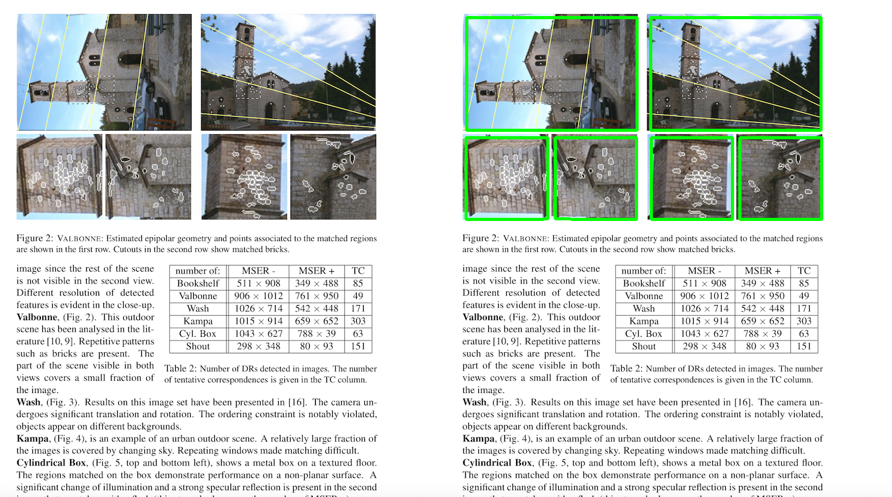
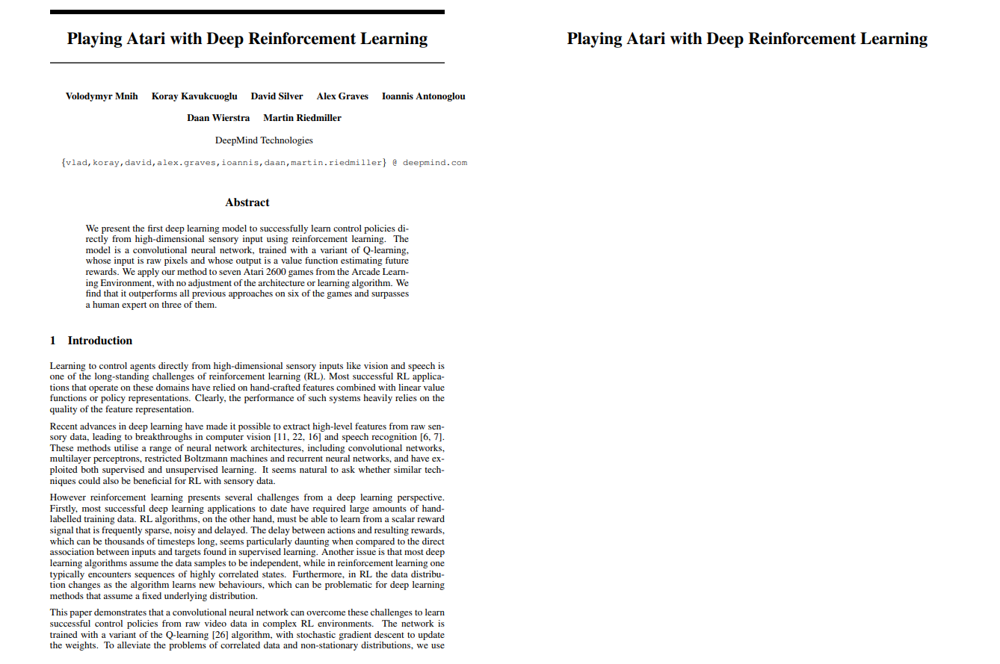

# Awesome Document Processing

Magical Document Processing methods for doing things that are rad as heck

## Setup

```bash
conda env create -f environment.yml
conda activate docproc
```

## Square Extraction



```bash
python ./squares.py
```

### Square Extraction Attribution

* [OpenCV Morphological Transformations](https://docs.opencv.org/3.0-beta/doc/py_tutorials/py_imgproc/py_morphological_ops/py_morphological_ops.html)
* [Detect Images in an image of a text document - C++ implementation](https://answers.opencv.org/question/75482/detect-images-in-an-image-of-a-text-document/)

## Title Extraction

Adjust the title ratio using the `size_ratio=1.5` value in `title.py`

You also need tesseract installed on your system. Follow the guide [here](https://github.com/tesseract-ocr/tesseract/wiki) for that



```bash
python ./title.py $(which tesseract)
```

### Title Extraction Attribution

* [Extract Title from the Image documents in python — Application of RLSA](https://medium.com/@vasista/extract-title-from-the-image-documents-in-python-application-of-rlsa-58f91237901f)
* [pythonRLSA](https://github.com/Vasistareddy/pythonRLSA)

## ImageMagik

### Side-by-Side

```bash
convert in/square-test.png out/square-test.png +append img/square-test.png
convert in/title-test.png out/title-test.png +append img/title-test.png
```